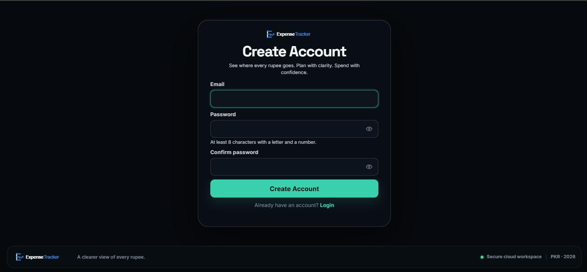
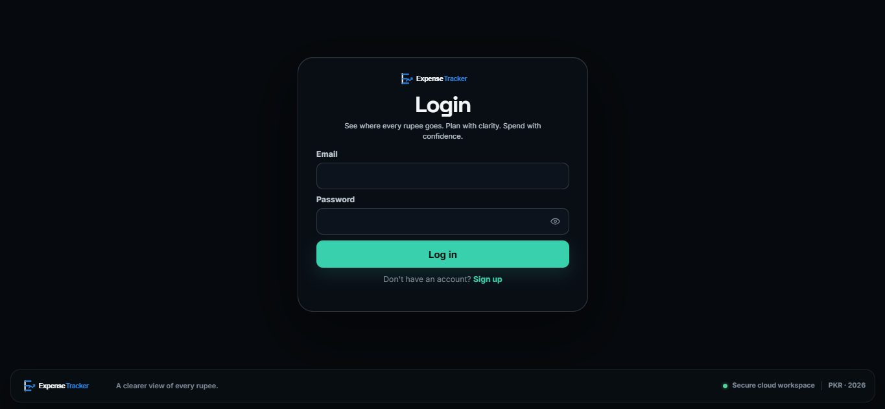
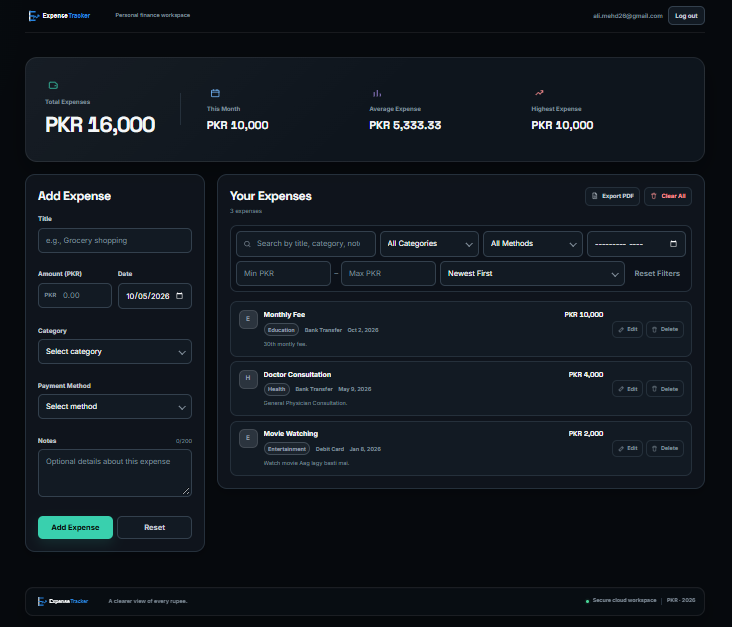
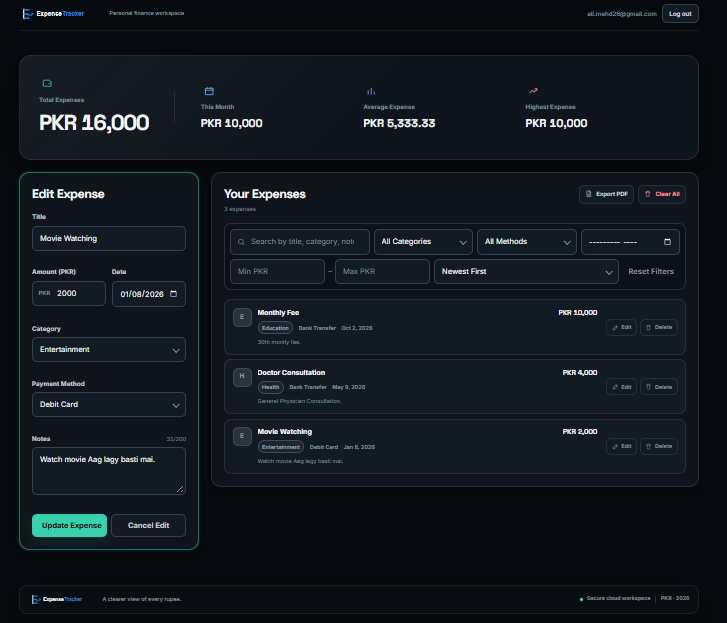
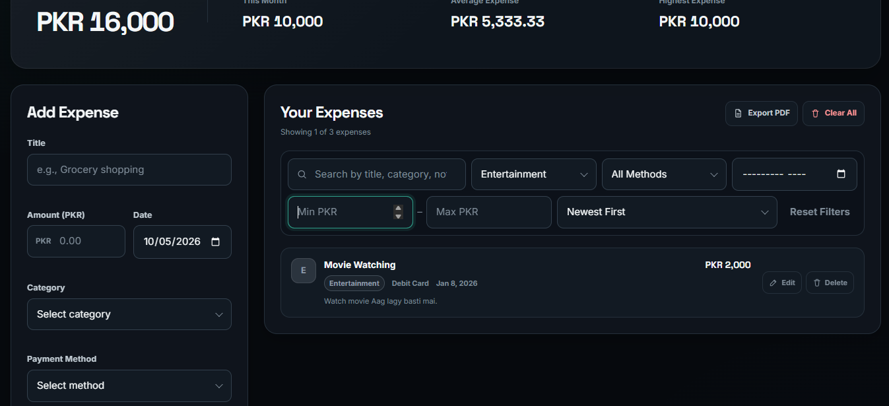
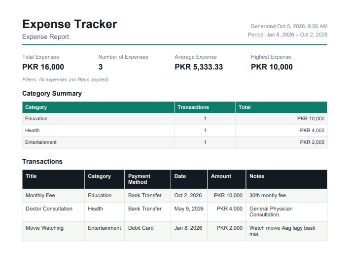

# Expense Tracker

> A modern, secure, and responsive personal expense management application built with Vanilla JavaScript, Supabase, PostgreSQL, and Vite.

Expense Tracker SaaS helps authenticated users record, manage, search, filter, sort, analyze, and export their personal expenses while keeping data isolated through PostgreSQL Row Level Security.

---

## Table of Contents

- [Overview](#overview)
- [Preview](#preview)
- [Features](#features)
- [Tech Stack](#tech-stack)
- [Application Architecture](#application-architecture)
- [Project Structure](#project-structure)
- [Database](#database)
- [Security](#security)
- [Getting Started](#getting-started)
- [Environment Variables](#environment-variables)
- [Available Scripts](#available-scripts)
- [Expense Workflow](#expense-workflow)
- [PDF Reporting](#pdf-reporting)
- [Responsive Design](#responsive-design)
- [Validation](#validation)
- [GitHub Safety](#github-safety)
- [Current Scope](#current-scope)
- [Future Enhancements](#future-enhancements)
- [Author](#author)

---

## Overview

Expense Tracker SaaS is a cloud-connected expense management application designed with a modern SaaS-style interface.

The application provides:

- Secure authentication
- Cloud-based expense storage
- Complete expense CRUD operations
- Dashboard statistics
- Search, filtering, and sorting
- PDF expense reports
- Responsive UI
- Accessibility-focused interactions
- PostgreSQL Row Level Security

All expense amounts are displayed in **PKR**.

---

## Preview

### Authentication





### Dashboard



### Expense Management



### Filtering



### PDF Reporting



---

## Features

### Authentication

- Email/password registration
- Secure login and logout
- Persistent Supabase sessions
- Automatic session restoration
- Password visibility toggle
- Login/Register switching
- Authentication validation
- Error and success feedback
- PKCE authentication flow

### Expense Management

Users can:

- Add expenses
- View expenses
- Edit expenses
- Delete individual expenses
- Clear all expenses
- Persist expenses in Supabase
- Manage only their own expense records

Each expense contains:

- Title
- Amount
- Category
- Payment method
- Date
- Notes

### Dashboard Analytics

The dashboard provides an overview of spending through:

- Total spending
- Current-month spending
- Average expense
- Highest expense
- Expense count
- Transaction history
- Category information

### Search, Filtering & Sorting

Expenses can be searched and filtered by:

- Search text
- Category
- Payment method
- Month
- Minimum amount
- Maximum amount

Multiple filters can be combined and reset.

Sorting options include:

- Newest First
- Oldest First
- Highest Amount
- Lowest Amount
- Alphabetical Order

### PDF Export

The application generates professional PDF expense reports containing:

- Reporting period
- Total spending
- Transaction count
- Average expense
- Highest expense
- Category summary
- Detailed transaction table
- Page numbering
- PKR currency formatting

PDF generation uses **jsPDF** and **AutoTable**.

### User Interface

The interface uses a modern SaaS visual system with:

- Dark glassmorphism styling
- Responsive layouts
- Consistent spacing and typography
- Modern cards and forms
- Interactive button states
- Loading states
- Empty states
- Error states
- Confirmation dialogs
- Toast notifications

### Accessibility

The application includes accessibility-focused UI features such as:

- Semantic HTML
- Form labels
- Keyboard-friendly controls
- Focus states
- ARIA attributes
- Accessible modal behavior
- Status messages
- Skip navigation
- Accessible password visibility controls

---

## Tech Stack

| Layer          | Technology                      |
| -------------- | ------------------------------- |
| Frontend       | HTML5, CSS3, Vanilla JavaScript |
| Build Tool     | Vite                            |
| Authentication | Supabase Auth                   |
| Database       | PostgreSQL via Supabase         |
| Authorization  | PostgreSQL Row Level Security   |
| Notifications  | SweetAlert2                     |
| PDF Generation | jsPDF + AutoTable               |
| Module System  | JavaScript ES Modules           |

---

## Application Architecture

```text
┌──────────────────────────────┐
│          Browser             │
│                              │
│  HTML + CSS + JavaScript     │
└──────────────┬───────────────┘
               │
               ▼
┌──────────────────────────────┐
│       Supabase Client        │
└──────────────┬───────────────┘
               │
        ┌──────┴──────┐
        ▼             ▼
┌─────────────┐ ┌─────────────┐
│ Supabase    │ │ PostgreSQL  │
│ Auth        │ │ Database    │
└─────────────┘ └──────┬──────┘
                       │
                       ▼
                ┌─────────────┐
                │     RLS     │
                │ User Access │
                └─────────────┘
```

### Application Layers

**Presentation Layer**

`index.html` and `Style.css` provide the structure and responsive visual interface.

**Application Layer**

`Script.js` manages authentication state, expense CRUD, validation, filtering, sorting, dashboard statistics, notifications, and PDF export.

**Data Layer**

`supabaseClient.js` initializes the Supabase client.

**Database Layer**

The Supabase migration creates the expenses table, constraints, indexes, triggers, permissions, and RLS policies.

---

## Project Structure

```text
expense-tracker-saas/
│
├── index.html
├── Style.css
├── Script.js
├── supabaseClient.js
│
├── package.json
├── package-lock.json
├── .env.example
├── .gitignore
├── manifest.webmanifest
├── README.md
│
├── public/
│   └── assets/
│       ├── background-Image/
│       │   └── background.webp
│       │
│       └── brand/
│           ├── expense-tracker-logo-dark.svg
│           ├── favicon.svg
│           └── icon-512.png
│
└── supabase/
    └── migrations/
        └── 001_create_expenses.sql
```

### Core Files

| File                      | Purpose                                                      |
| ------------------------- | ------------------------------------------------------------ |
| `index.html`              | Application markup and UI structure                          |
| `Style.css`               | Complete responsive styling and design system                |
| `Script.js`               | Application logic, CRUD, auth, filters, sorting, PDF export  |
| `supabaseClient.js`       | Supabase client initialization                               |
| `package.json`            | Project scripts and dependencies                             |
| `.env.example`            | Environment variable template                                |
| `001_create_expenses.sql` | Database schema, RLS, constraints, triggers, and permissions |
| `manifest.webmanifest`    | Web app metadata                                             |

---

## Database

The application uses the following main table:

```text
public.expenses
```

### Schema

| Column           | Type        | Description               |
| ---------------- | ----------- | ------------------------- |
| `id`             | UUID        | Unique expense identifier |
| `user_id`        | UUID        | Authenticated owner       |
| `title`          | VARCHAR     | Expense title             |
| `amount`         | NUMERIC     | Expense amount            |
| `category`       | VARCHAR     | Expense category          |
| `payment_method` | VARCHAR     | Payment method            |
| `date`           | DATE        | Expense date              |
| `notes`          | TEXT        | Optional notes            |
| `created_at`     | TIMESTAMPTZ | Creation timestamp        |
| `updated_at`     | TIMESTAMPTZ | Last update timestamp     |

### Categories

- Food
- Transport
- Shopping
- Bills
- Entertainment
- Health
- Education
- Travel
- Other

### Payment Methods

- Cash
- Debit Card
- Credit Card
- Bank Transfer
- Digital Wallet

### Database Protection

The migration includes:

- Primary key
- Foreign key to `auth.users`
- Data constraints
- User/date index
- Automatic `updated_at` handling
- Future-date protection
- Row Level Security
- Authenticated CRUD policies
- Anonymous access restrictions

---

## Security

Security is enforced at the database level as well as in the application.

### Row Level Security

RLS is enabled on `public.expenses`.

The policies restrict access using the authenticated Supabase user:

```sql
auth.uid() = user_id
```

Separate policies are defined for:

- `SELECT`
- `INSERT`
- `UPDATE`
- `DELETE`

This means the database, rather than frontend filtering, is responsible for enforcing user ownership.

### Environment Security

The application reads configuration from environment variables:

- `VITE_SUPABASE_URL`
- `VITE_SUPABASE_PUBLISHABLE_KEY`

Only a browser-safe Supabase publishable key should be used.

Never expose or commit:

- Service-role keys
- Database passwords
- Private API keys
- Secret credentials
- Real `.env` files

---

## Getting Started

### Prerequisites

Install:

- Node.js
- npm
- A Supabase project

### 1. Clone the Repository

```bash
git clone YOUR_REPOSITORY_URL
cd expense-tracker-saas
```

### 2. Install Dependencies

```bash
npm install
```

### 3. Configure Environment Variables

Create a `.env` file in the project root using `.env.example` as the template:

```env
VITE_SUPABASE_URL=https://YOUR_PROJECT.supabase.co
VITE_SUPABASE_PUBLISHABLE_KEY=YOUR_PUBLISHABLE_KEY
```

Do not commit the `.env` file.

### 4. Configure the Database

Open the Supabase SQL Editor and execute:

```text
supabase/migrations/001_create_expenses.sql
```

The migration creates the table, validation rules, index, triggers, permissions, and RLS policies.

### 5. Start the Development Server

```bash
npm run dev
```

Vite will provide the local development URL in the terminal.

---

## Available Scripts

| Command           | Purpose                           |
| ----------------- | --------------------------------- |
| `npm run dev`     | Start the Vite development server |
| `npm run build`   | Create a production build         |
| `npm run preview` | Preview the production build      |

---

## Expense Workflow

```text
Register / Login
       │
       ▼
Authenticated Dashboard
       │
       ▼
Add Expense
       │
       ▼
Supabase Database
       │
       ▼
Dashboard Statistics
       │
       ├── Search
       ├── Filter
       └── Sort
       │
       ▼
Edit / Delete
       │
       ▼
PDF Report
```

---

## PDF Reporting

PDF reports provide a structured summary of expense activity.

### Report Contents

- Reporting period
- Total spending
- Transaction count
- Average expense
- Highest expense
- Category summary
- Transaction details
- Page numbers

Reports use an A4 document layout and PKR currency formatting.

PDF libraries are loaded dynamically when the export feature is used.

---

## Validation

The application and database validate expense data including:

- Required fields
- Title length
- Positive amounts
- Maximum amount
- Category
- Payment method
- Valid dates
- Future-date restrictions
- Notes length
- Whitespace handling

Registration also applies password validation requirements.

---

## Responsive Design

The UI is designed for:

- Mobile phones
- Tablets
- Laptops
- Desktop monitors
- Large displays

Responsive behavior covers authentication screens, dashboard cards, forms, filters, expense records, modals, buttons, and notifications.

---

## GitHub Safety

The repository uses `.gitignore` to exclude sensitive and generated files:

```text
node_modules/
dist/
.env
.env.*
```

The repository should contain source code, configuration templates, database migrations, assets, and documentation.

Do not commit:

- `.env`
- `node_modules`
- Generated build output
- Temporary files
- Private credentials

---

## Verification

Before deployment, run:

```bash
npm install
npm run build
npm run preview
```

Recommended functional verification includes:

- Registration
- Login
- Logout
- Session restoration
- Add expense
- Edit expense
- Delete expense
- Clear all
- Search
- Filtering
- Sorting
- PDF export
- Reload persistence
- Responsive layouts
- Database persistence
- RLS user isolation

The project should only be considered fully verified after these checks have been executed in the target environment.

---

## Current Scope

The current application focuses on personal expense tracking.

It does not currently include:

- Team/workspace expense sharing
- Bank account synchronization
- Automatic bank imports
- Subscription billing
- Administrative dashboards
- Multi-currency transaction management

---